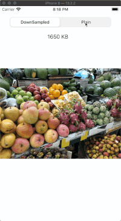

# SDRemoteImageView


## Introduction

Images are biggest factor for memory footprint. To make minimal footprint while dealing with images, you should use technique called `downsampling` when possible. This project shows you a way to apply the technique.

To understand concept behind the `downsampling` more deeply, please checkout WWDC talk [Images and Graphics Best Practices](https://developer.apple.com/videos/play/wwdc2018/219/) . It's one of the must-see session for all iOS developers. ​​

## Demo



## Example

To run the example project, clone the repo, and run `pod install` from the Example directory first.

## Requirements

This project has zero depdencies other than Foundation and UIKit

## Installation

SDRemoteImageView is available through [CocoaPods](https://cocoapods.org). To install
it, simply add the following line to your Podfile:

```ruby
pod 'SDRemoteImageView'
```

## Author

e-sung, dev.esung@gmail.com, https://twitter.com/sungdooyoo

## License

SDRemoteImageView is available under the MIT license. See the LICENSE file for more info.
